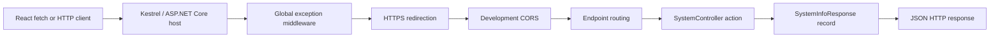
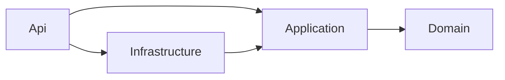
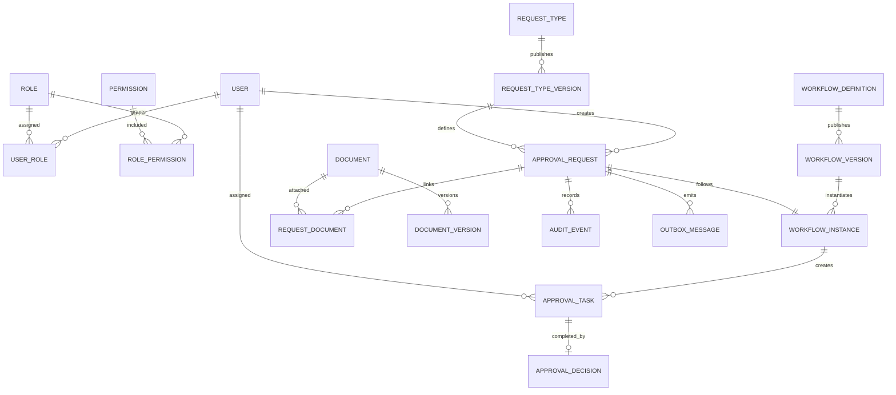
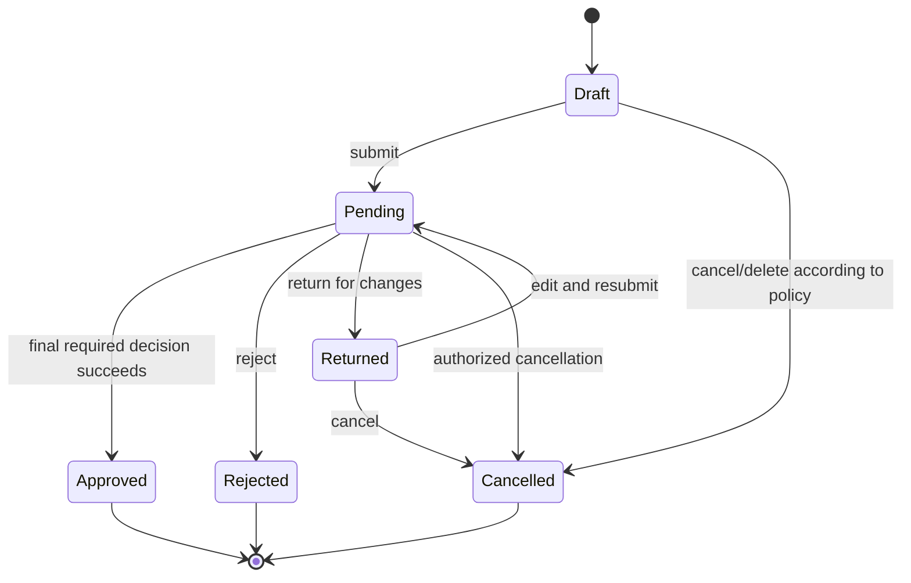

# Independent Approval ASP.NET Core API

## Complete current-code guide and implementation roadmap

> Audited on 9 August 2026 from branch `feat/react-api-integration` at commit
> `1d9a770`. The API targets .NET 10. This document separates **current** behavior
> from **proposed** behavior. Nothing in a "target" section exists until it is
> implemented and tested.

## 1. Executive summary

The repository does **not** yet contain a complete approval API. It contains a
good Stage 1 ASP.NET Core foundation:

- an ASP.NET Core host;
- controller routing;
- `GET /api/system/info`;
- a basic `GET /health` process check;
- development-only OpenAPI JSON;
- development-only credentialed CORS for the Vite client; and
- centralized handling of otherwise unhandled exceptions as Problem Details.

All request, task, document, dashboard, user, role, workflow, request-type, and
settings data still comes from TypeScript mock files in the React client. There
is no database, login, authorization, workflow engine, file storage, audit log,
notification worker, domain API, automated test project, or production
deployment configuration.

### Current readiness matrix

| Capability | Current state | What remains |
|---|---|---|
| Project host and build | Working | Pin SDK and add CI |
| Controller routing | Working | Add domain controllers and versioning |
| System information | Working | Decide whether it may be anonymous in production |
| Health | Basic liveness only | Add readiness checks for database and storage |
| OpenAPI | JSON in Development | Add complete metadata, security scheme, examples, and compatibility checks |
| Error handling | Unexpected `500` errors only | Map validation, not-found, forbidden, conflict, and concurrency errors |
| CORS | Development origins only | Prefer same-origin production hosting or configure exact production origins |
| Persistence | Missing | EF Core model, database, migrations, indexes, backup/restore |
| Authentication | Missing | Choose Windows Integrated Authentication or OIDC |
| Authorization | Missing | Roles, permissions, and resource-level rules |
| Requests and workflow | Missing | Draft, submit, route, decide, return, reject, cancel, audit |
| Tasks | Missing | Queue, detail, decisions, concurrency, escalation |
| Documents | Missing | Secure upload, scan, store, version, authorize, download |
| Administration | Missing | Users, roles, workflows, request types, settings |
| Tests | Missing | Unit, integration, contract, security, and end-to-end tests |
| Production operations | Missing | Telemetry, alerts, controlled deployment, recovery runbooks |

The most useful next goal is a **secure request-to-approval MVP**, not a large
set of unrelated CRUD endpoints. A submitted request must create exactly the
right task, an authorized independent approver must be able to make exactly one
decision, and every change must be durable and auditable.

## 2. How this ASP.NET Core API works

### 2.1 Request path today



For `GET /api/system/info`, the steps are:

1. ASP.NET Core creates the host from `WebApplication.CreateBuilder(args)`.
2. Configuration is loaded from `appsettings.json`, the environment-specific
   settings file, environment variables, and command-line arguments.
3. Services such as controllers and the exception handler are registered in the
   dependency-injection container.
4. Middleware is assembled in the order written in `Program.cs`.
5. Routing matches `/api/system/info` to `SystemController.GetInfo`.
6. ASP.NET Core injects `IHostEnvironment` into the controller's primary
   constructor.
7. The action creates a `SystemInfoResponse` C# record.
8. `Ok(response)` produces status `200` and ASP.NET Core serializes the record
   to camel-case JSON.

### 2.2 Important ASP.NET Core concepts in this project

- **Services** are registered on `builder.Services`. Registration tells the
  dependency-injection container how to construct controllers and other types.
- **Middleware** processes every request in order. Order matters: exception
  handling must wrap later work, CORS must run before controller endpoints, and
  future authentication must run before authorization.
- **Controllers** group HTTP actions. `[Route]` defines the URL prefix and
  `[HttpGet]`, `[HttpPost]`, and similar attributes define verbs and paths.
- **Contracts/DTOs** are the public request and response shapes. They must be
  separate from future EF Core database entities.
- **Configuration environments** allow different settings in Development,
  Test, and Production without changing source code.
- **Problem Details** is the standard JSON shape used to explain HTTP API
  errors. The current handler uses it only for unexpected failures.
- **OpenAPI** describes endpoints in machine-readable JSON. The project does
  not currently install an interactive Swagger UI.

## 3. Current server file tree

Generated `bin` and `obj` files are omitted.

```text
server/IndependentApproval.Api/
|-- appsettings.json
|-- appsettings.Development.json
|-- IndependentApproval.Api.csproj
|-- IndependentApproval.Api.http
|-- Program.cs
|-- Contracts/
|   `-- System/
|       `-- SystemInfoResponse.cs
|-- Controllers/
|   `-- SystemController.cs
|-- Infrastructure/
|   `-- GlobalExceptionHandler.cs
`-- Properties/
    `-- launchSettings.json
```

## 4. Build, run, and call the current API

### 4.1 Prerequisites

- .NET SDK 10.0.x;
- Node.js/npm for the React client;
- a trusted ASP.NET Core development HTTPS certificate; and
- ports `7074`, `5142`, and the selected Vite port available locally.

Check the SDK:

```powershell
dotnet --info
```

Trust the development certificate once on a development computer:

```powershell
dotnet dev-certs https --trust
```

### 4.2 How the foundation can be created from scratch

These commands explain the initial ASP.NET Core setup. Do **not** run them over
this repository because the solution and project already exist.

```powershell
dotnet new sln --name IndependentApproval
dotnet new webapi --name IndependentApproval.Api --output server/IndependentApproval.Api --framework net10.0 --use-controllers
dotnet sln IndependentApproval.sln add server/IndependentApproval.Api/IndependentApproval.Api.csproj
dotnet add server/IndependentApproval.Api/IndependentApproval.Api.csproj package Microsoft.AspNetCore.OpenApi --version 10.0.7
dotnet add server/IndependentApproval.Api/IndependentApproval.Api.csproj package Microsoft.OpenApi --version 2.7.5
```

After generating the template:

1. remove its sample Weather Forecast endpoint/files;
2. create the `Contracts/System`, `Controllers`, and `Infrastructure` folders;
3. replace `Program.cs` and add the files exactly as shown in section 5;
4. add the two configuration files and launch profiles; and
5. add the `.http` smoke-test requests.

`dotnet new` output can vary by SDK patch, so section 5—not a newly generated
template—is the authoritative current code.

### 4.3 Restore and build

From the repository root:

```powershell
dotnet restore IndependentApproval.sln
dotnet build IndependentApproval.sln --configuration Debug
```

At the audited commit, the solution builds with zero warnings and zero errors.

### 4.4 Run the API

```powershell
dotnet run --project server/IndependentApproval.Api --launch-profile https
```

The HTTPS profile listens at:

- `https://localhost:7074`
- `http://localhost:5142`

Use HTTPS for normal development. `UseHttpsRedirection()` redirects HTTP when
ASP.NET Core can determine the HTTPS port.

### 4.5 Connect the current Vite client

The client reads `VITE_API_BASE_URL`. With no value, it sends the request to the
Vite origin, which normally cannot reach this independent API. Create the
ignored file `client/.env`:

```dotenv
VITE_API_BASE_URL=https://localhost:7074
```

Then run:

```powershell
Set-Location client
npm ci
npm run dev
```

The configured development CORS origins are currently
`http://localhost:5173` and `http://localhost:5174`. If Vite selects another
port, either free one of those ports or add the exact origin to
`appsettings.Development.json`.

### 4.6 Call the endpoints

Use `IndependentApproval.Api.http` in an editor with an HTTP client extension,
or use PowerShell:

```powershell
Invoke-RestMethod https://localhost:7074/api/system/info
Invoke-WebRequest https://localhost:7074/health
Invoke-WebRequest https://localhost:7074/openapi/v1.json
```

The OpenAPI route exists only when `ASPNETCORE_ENVIRONMENT=Development`.

### 4.7 Current troubleshooting notes

- If the HTTPS profile does not start or the browser rejects the connection,
  run `dotnet dev-certs https --trust` and restart the terminal/browser.
- The `http` launch profile exposes no HTTPS listener while
  `UseHttpsRedirection()` is unconditional. ASP.NET Core can log "Failed to
  determine the https port for redirect" and pass the request through. Prefer
  the combined `https` profile; explicitly configure trusted forwarded headers
  when production TLS terminates at IIS/reverse proxy.
- Use `dotnet run --project server/IndependentApproval.Api ...` as shown. If the
  built DLL is launched with the repository root as its content root,
  `appsettings.Development.json` may not be discovered and the deliberate
  missing-CORS-origin check will stop startup.
- In the audited restricted Windows environment, the default Event Log logging
  provider could not write under the process identity. A logging failure then
  interfered with both startup warnings and the global exception handler. Test
  logging under the real IIS/app service identity; configure a writable source
  or remove that provider when it is not part of the logging design. The error
  handler should also have a safe response fallback if logging fails.
- If Vite uses a port other than `5173` or `5174`, the browser will block reading
  cross-origin responses until the exact origin is configured.

## 5. Complete current server code

This section contains every hand-written source and configuration file in the
current API. It is the **whole current server**, not the future approval system.

### 5.1 `IndependentApproval.Api.csproj`

```xml
<Project Sdk="Microsoft.NET.Sdk.Web">

  <PropertyGroup>
    <TargetFramework>net10.0</TargetFramework>
    <Nullable>enable</Nullable>
    <ImplicitUsings>enable</ImplicitUsings>
  </PropertyGroup>

  <ItemGroup>
    <PackageReference Include="Microsoft.AspNetCore.OpenApi" Version="10.0.7" />
    <PackageReference Include="Microsoft.OpenApi" Version="2.7.5" />
  </ItemGroup>

</Project>
```

What it does:

- `Microsoft.NET.Sdk.Web` supplies the ASP.NET Core web host and shared
  framework.
- `net10.0` selects .NET 10.
- nullable reference types make nullability part of the compiler contract.
- implicit usings reduce repeated common `using` statements.
- the OpenAPI packages generate the development JSON document.

### 5.2 `Program.cs`

```csharp
using IndependentApproval.Api.Infrastructure;

const string DevClientCorsPolicy = "DevClient";
const string DevClientOriginsConfigurationKey = "Cors:DevClient:AllowedOrigins";

var builder = WebApplication.CreateBuilder(args);

builder.Services.AddControllers();
builder.Services.AddHealthChecks();
builder.Services.AddProblemDetails();
builder.Services.AddExceptionHandler<GlobalExceptionHandler>();

if (builder.Environment.IsDevelopment())
{
    var allowedOrigins = builder.Configuration
        .GetSection(DevClientOriginsConfigurationKey)
        .GetChildren()
        .Select(section => section.Value)
        .OfType<string>()
        .Where(origin => !string.IsNullOrWhiteSpace(origin))
        .ToArray();

    if (allowedOrigins.Length == 0)
    {
        throw new InvalidOperationException(
            $"No development client origins are configured at '{DevClientOriginsConfigurationKey}'.");
    }

    builder.Services.AddCors(options =>
    {
        options.AddPolicy(DevClientCorsPolicy, policy =>
        {
            policy
                .WithOrigins(allowedOrigins)
                .AllowAnyHeader()
                .AllowAnyMethod()
                .AllowCredentials();
        });
    });

    builder.Services.AddOpenApi();
}

var app = builder.Build();

app.UseExceptionHandler();
app.UseHttpsRedirection();

if (app.Environment.IsDevelopment())
{
    app.UseCors(DevClientCorsPolicy);
    app.MapOpenApi();
}

app.MapControllers();
app.MapHealthChecks("/health");

app.Run();
```

Line-group explanation:

1. The constants prevent the CORS policy name and configuration path from
   being repeated as unexplained strings.
2. `CreateBuilder` creates configuration, logging, hosting, and dependency
   injection.
3. `AddControllers` discovers attribute-routed controllers.
4. `AddHealthChecks` registers health-check services. No dependency-specific
   check is registered yet.
5. `AddProblemDetails` registers the service used to write standard error JSON.
6. `AddExceptionHandler<GlobalExceptionHandler>` registers the custom fallback
   handler.
7. In Development only, allowed origins are read as a string array. Startup
   intentionally fails when the list is empty.
8. The named CORS policy permits any method/header and credentials, but only
   for exact configured origins. This is compatible with the client's
   `credentials: 'include'` setting.
9. OpenAPI services are registered only in Development.
10. `Build` changes from service registration to the HTTP request pipeline.
11. `UseExceptionHandler` catches exceptions from later middleware/endpoints.
12. `UseHttpsRedirection` redirects suitable HTTP requests to HTTPS.
13. Development CORS is applied and `/openapi/v1.json` is mapped.
14. Controller routes and `/health` are mapped.
15. `Run` starts the server and blocks until shutdown.

### 5.3 `Infrastructure/GlobalExceptionHandler.cs`

```csharp
using Microsoft.AspNetCore.Diagnostics;
using Microsoft.AspNetCore.Mvc;

namespace IndependentApproval.Api.Infrastructure;

public sealed class GlobalExceptionHandler(
    ILogger<GlobalExceptionHandler> logger,
    IProblemDetailsService problemDetailsService) : IExceptionHandler
{
    public async ValueTask<bool> TryHandleAsync(
        HttpContext httpContext,
        Exception exception,
        CancellationToken cancellationToken)
    {
        logger.LogError(
            exception,
            "An unhandled exception occurred while processing {Method} {Path}. Trace identifier: {TraceIdentifier}",
            httpContext.Request.Method,
            httpContext.Request.Path,
            httpContext.TraceIdentifier);

        httpContext.Response.StatusCode = StatusCodes.Status500InternalServerError;

        var problemDetails = new ProblemDetails
        {
            Status = StatusCodes.Status500InternalServerError,
            Title = "An unexpected error occurred.",
            Type = "https://www.rfc-editor.org/rfc/rfc9110#section-15.6.1",
            Instance = httpContext.Request.Path
        };
        problemDetails.Extensions["traceId"] = httpContext.TraceIdentifier;

        await problemDetailsService.WriteAsync(new ProblemDetailsContext
        {
            HttpContext = httpContext,
            ProblemDetails = problemDetails
        });

        return true;
    }
}
```

The primary constructor injects a logger and Problem Details writer. The handler
logs the full exception server-side, returns a generic message to the caller,
and includes a `traceId` that can be matched to logs. This avoids exposing stack
traces or internal exception messages.

The missing behavior is intentional mapping of known failures. A missing
request must be `404`, invalid input `400` or `422`, an unauthorized caller
`401`/`403`, an invalid workflow transition `409`, and a stale version `412`.
Those situations should not all become `500`.

For hardening, prefer `IProblemDetailsService.TryWriteAsync` plus a minimal safe
fallback. `WriteAsync` can itself fail when no registered writer accepts the
caller's `Accept` header. Also ensure a failing logging provider cannot prevent
the API from returning the generic error response.

### 5.4 `Controllers/SystemController.cs`

```csharp
using IndependentApproval.Api.Contracts.System;
using Microsoft.AspNetCore.Mvc;

namespace IndependentApproval.Api.Controllers;

[ApiController]
[Route("api/system")]
public sealed class SystemController(IHostEnvironment hostEnvironment) : ControllerBase
{
    private const string ApplicationName = "Independent Approval API";

    private static readonly string ApplicationVersion =
        typeof(SystemController).Assembly.GetName().Version?.ToString() ?? "Unknown";

    [HttpGet("info")]
    [ProducesResponseType<SystemInfoResponse>(StatusCodes.Status200OK)]
    public ActionResult<SystemInfoResponse> GetInfo()
    {
        var response = new SystemInfoResponse(
            ApplicationName,
            ApplicationVersion,
            hostEnvironment.EnvironmentName,
            DateTimeOffset.UtcNow);

        return Ok(response);
    }
}
```

- `[ApiController]` enables API conventions including automatic model
  validation responses for future annotated request DTOs.
- `[Route("api/system")]` defines the controller prefix.
- `[HttpGet("info")]` produces the final route `GET /api/system/info`.
- the version comes from assembly metadata;
- the environment comes from hosting configuration; and
- `DateTimeOffset.UtcNow` produces an unambiguous UTC timestamp.

Because the endpoint is currently anonymous, decide whether exposing the
environment/version is acceptable in production. A common policy is to
authenticate this endpoint or return only non-sensitive build information.
The project currently has no explicit version metadata, so its assembly version
defaults to `1.0.0.0`; set `Version`/`InformationalVersion` from the release
pipeline when this becomes operational metadata.

### 5.5 `Contracts/System/SystemInfoResponse.cs`

```csharp
namespace IndependentApproval.Api.Contracts.System;

public sealed record SystemInfoResponse(
    string ApplicationName,
    string Version,
    string Environment,
    DateTimeOffset CurrentUtcTimestamp);
```

A record is appropriate for an immutable response value. Default ASP.NET Core
JSON naming converts `ApplicationName` to `applicationName`, matching the
client's `SystemInfo` interface.

### 5.6 `appsettings.json`

```json
{
  "Logging": {
    "LogLevel": {
      "Default": "Information",
      "Microsoft.AspNetCore": "Warning"
    }
  },
  "AllowedHosts": "*"
}
```

This is shared configuration. `AllowedHosts: "*"` is convenient during the
foundation stage but should become the exact production host names. No secrets
or connection strings should be committed here.

### 5.7 `appsettings.Development.json`

```json
{
  "Cors": {
    "DevClient": {
      "AllowedOrigins": [
        "http://localhost:5173",
        "http://localhost:5174"
      ]
    }
  },
  "Logging": {
    "LogLevel": {
      "Default": "Information",
      "Microsoft.AspNetCore": "Warning"
    }
  }
}
```

This file overrides/extends base settings only in Development. An origin
includes scheme, host, and port; `http://localhost:5173` and
`https://localhost:5173` are different origins.

The current loader rejects blank values but does not trim or deduplicate valid
strings. Normalize configured origins so accidental spaces do not create a
silent non-match.

### 5.8 `Properties/launchSettings.json`

```json
{
  "$schema": "https://json.schemastore.org/launchsettings.json",
  "profiles": {
    "http": {
      "commandName": "Project",
      "dotnetRunMessages": true,
      "launchBrowser": false,
      "applicationUrl": "http://localhost:5142",
      "environmentVariables": {
        "ASPNETCORE_ENVIRONMENT": "Development"
      }
    },
    "https": {
      "commandName": "Project",
      "dotnetRunMessages": true,
      "launchBrowser": false,
      "applicationUrl": "https://localhost:7074;http://localhost:5142",
      "environmentVariables": {
        "ASPNETCORE_ENVIRONMENT": "Development"
      }
    }
  }
}
```

Launch settings are for local tooling and are not production server
configuration. Both profiles select Development; the `https` profile is the
normal choice.

### 5.9 `IndependentApproval.Api.http`

```http
@IndependentApproval.Api_HostAddress = https://localhost:7074

GET {{IndependentApproval.Api_HostAddress}}/api/system/info
Accept: application/json

###

GET {{IndependentApproval.Api_HostAddress}}/health
Accept: text/plain

###
```

This is a convenient manual smoke-test file. It is not an automated test and
does not fail a build when behavior changes.

## 6. Exact current HTTP surface

### `GET /api/system/info`

Purpose: prove that the independent React client can reach the API and show
basic deployment information.

Example `200 OK` response:

```json
{
  "applicationName": "Independent Approval API",
  "version": "1.0.0.0",
  "environment": "Development",
  "currentUtcTimestamp": "2026-08-09T12:34:56.789+00:00"
}
```

The exact version and timestamp vary.

### `GET /health`

Purpose today: liveness only. The default response is plain text:

```text
Healthy
```

It remains healthy even if a future database, file share, or mail server is
down until dependency checks are explicitly registered.

### `GET /openapi/v1.json`

Purpose: development-only machine-readable API description. `MapOpenApi()` does
not provide an interactive Swagger page by itself. The audited document is
OpenAPI 3.1.1 and contains `/api/system/info`; the mapped health endpoint is not
included. Add explicit `[Produces("application/json")]` metadata if the contract
must advertise JSON only, because the generated response currently lists
several MVC output media types.

### Current routing and CORS behavior

- an unknown route returns an empty `404`;
- using an unsupported method on the system route returns an empty `405` with
  `Allow: GET`;
- `AddProblemDetails` alone does not add a body to those routing responses;
  use status-code handling/customization if all errors must share a contract;
- an allowed CORS preflight returns `204` and the exact allow-origin and
  allow-credentials headers; and
- a disallowed browser origin can still receive a server-side `200`, but without
  CORS response headers the browser prevents JavaScript from reading it. This
  is expected because CORS is enforced by browsers, not an API authorization
  boundary.

## 7. What the React application proves the API must support

Only `systemService` calls the real server. `mockDataService` currently supplies
all other screens synchronously.

| React area | Current source | Required backend capability |
|---|---|---|
| Header/current user | `mocks/currentUser.ts` | Authenticated current-user and permission response |
| Dashboard | `mocks/dashboard.ts` | Server-calculated counts, recent requests, pending tasks |
| My Requests | `mocks/requests.ts` | Filtered/paged request query and request detail |
| New Request | inert form | Draft save, validation, attachments, submit |
| My Tasks | `mocks/tasks.ts` | Assigned task queue, detail, approve/reject/return actions |
| Documents | `mocks/documents.ts` | Metadata, secure upload/download, links, versions |
| Administration | `mocks/administration.ts` | Users, roles, workflows, request types, settings, metrics |

### Important client gaps to fix with the API

- `apiClient` supports GET only. It needs JSON POST/PUT/PATCH/DELETE,
  `multipart/form-data`, Problem Details parsing, cancellation, `401`/`403`
  behavior, ETags, and idempotency keys.
- Domain services must become asynchronous and pages need loading, error,
  empty, retry, and conflict states.
- the new-request form prevents submission and its buttons have no behavior;
- search, filters, actions, uploads, downloads, and admin buttons are inert;
- `businessJustification` exists in the form but not the request model;
- the client uses a single role, while a real user may have several roles and
  fine-grained permissions;
- category dropdown values use lowercase slugs while mock models use display
  text. The API needs canonical identifiers;
- timestamps and "due today" values are hard-coded in UI code;
- dashboard totals do not equal the small representative mock arrays;
- the client README still says it makes no API calls, but system information is
  now live; and
- static categories conflict with the planned configurable request types and
  forms.

## 8. Decisions required before implementation

These decisions affect database keys, security middleware, endpoint contracts,
and deployment. Record them as Architecture Decision Records before writing the
domain API.

### 8.1 Identity and hosting

Evidence in the repository (`TEST\\mohammed`, "on-premises", and
`credentials: 'include'`) suggests an intranet application.

Recommended default for an intranet: Windows Integrated Authentication through
IIS, keyed by an immutable directory SID, with application roles/permissions in
the database. Kestrel with Negotiate is another option, but proxy/Kerberos
topology must be designed correctly.

Choose OIDC instead when users are external, a modern identity provider is
required, or the proxy/network cannot safely preserve integrated authentication.
Do not build a new password database without an explicit business reason.

### 8.2 Database

Recommended on a Windows/on-premises deployment: SQL Server with EF Core. Record
the supported SQL Server version, high-availability requirements, backup
schedule, recovery point objective, and recovery time objective.

### 8.3 File storage

Choose a hardened file share or on-premises object store. Store metadata in SQL
and bytes outside the web root. Define maximum size/count, allowed types,
antivirus scanning, retention, legal hold, encryption, and backup behavior.

### 8.4 Workflow scope

For the first usable release, decide whether workflows are:

- sequential only, or sequential plus parallel stages;
- assigned to a person, role, group, manager, or expression result;
- approved by all parallel members or a quorum;
- returned to the requester or a previous step;
- reassignable/delegatable;
- governed by due dates, reminders, and escalation; and
- versioned after publication.

The core independent-approval rule should be explicit: a requester or other
disallowed beneficiary must never approve their own request, including through
delegation. Enforce it in the server and database transaction, never only in the
UI.

### 8.5 Production topology

Recommended default: host the built React application and API under one HTTPS
origin behind IIS. This simplifies credential flow and removes most production
CORS concerns. If origins differ, list exact trusted origins; CORS is a browser
interoperability setting, not authentication or authorization.

## 9. Recommended target architecture

Use a modular monolith first: one deployable API with clear internal layers. A
workflow system needs transactional consistency more than it needs early
microservices.

```text
server/
|-- IndependentApproval.Api/             HTTP, middleware, DTOs, controllers
|-- IndependentApproval.Application/     use cases, interfaces, authorization
|-- IndependentApproval.Domain/          entities, value objects, state rules
`-- IndependentApproval.Infrastructure/  EF Core, identity, files, email/outbox
tests/
|-- IndependentApproval.Domain.Tests/
|-- IndependentApproval.Application.Tests/
`-- IndependentApproval.Api.IntegrationTests/
```

Dependency direction:



The Domain project must not depend on EF Core, ASP.NET Core, SMTP, or file-system
types. The Application project defines use cases and interfaces. Infrastructure
implements those interfaces. API translates HTTP contracts into application
commands and queries.

For a smaller team, the same boundaries can initially be folders in one project,
but the dependency rules and tests should remain the same.

### Suggested feature layout in the API

```text
Contracts/
|-- Common/
|-- Identity/
|-- Requests/
|-- Tasks/
|-- Documents/
|-- Dashboard/
`-- Administration/
Controllers/
|-- MeController.cs
|-- RequestsController.cs
|-- TasksController.cs
|-- DocumentsController.cs
|-- DashboardController.cs
`-- Admin/
Infrastructure/
|-- Errors/
|-- Authentication/
|-- Persistence/
|-- Files/
|-- Notifications/
`-- Observability/
```

## 10. Domain and database model

### 10.1 Core relationships



### 10.2 Required tables/entities

| Entity | Essential data and rules |
|---|---|
| `AppUser` | Immutable external SID/subject, username, display name, email, department, status, timestamps |
| `Role`, `Permission` | Many-to-many mappings; policies should use permissions rather than UI role names alone |
| `RequestType` | Stable identity and lifecycle |
| `RequestTypeVersion` | Immutable published form schema and document requirements |
| `WorkflowDefinition` | Stable workflow identity |
| `WorkflowVersion` | Immutable published steps, transitions, assignment/SLA rules |
| `ApprovalRequest` | Number, requester, version IDs, title, description, justification, priority, money, state, timestamps, row version |
| `WorkflowInstance` | Frozen workflow version and current runtime state |
| `ApprovalTask` | Assignee, action kind, state, received/due/completed times, row version |
| `ApprovalDecision` | Immutable actor, outcome, comment, timestamp, before/after state |
| `Document` | Logical document and status |
| `DocumentVersion` | Storage key, safe display name, MIME, size, hash, scan state, uploader/time |
| `RequestDocument` | Authorized link between a request and document |
| `AuditEvent` | Append-only business audit record |
| `OutboxMessage` | Transactionally queued event for notifications/background work |
| `Notification` | In-app state and delivery result |
| `SystemSetting` | Validated organization configuration with concurrency token |

### 10.3 Database constraints and indexes

- use database-generated GUIDs/UUIDs or another explicitly chosen stable key;
- generate request numbers from a database sequence, never `MAX(number) + 1`;
- make request number and external user identity unique;
- use an explicit money precision such as `decimal(19,4)` and an ISO 4217
  three-character currency code;
- require amount and currency to be both present or both absent;
- use `DateTimeOffset` and store UTC instants;
- use SQL `rowversion` or another optimistic concurrency token on mutable
  aggregates and configuration;
- index requester/status/updated time, assignee/task status/due time, request
  documents, and unprocessed outbox messages;
- preserve published request-type and workflow versions; and
- use restrictive foreign-key deletes where audit/history must survive.

Display names such as `requesterName`, `currentApprover`, and `ownerName` are
read-model projections. They should not replace foreign keys in authoritative
tables.

The current mock gives even a Draft a request number. Decide whether the number
is reserved when the draft is created or only when it is submitted. The flow
below assumes allocation on submission; retaining the current UI behavior means
moving that sequence allocation into the draft-creation transaction instead.

## 11. State machines and transaction rules

### 11.1 Request lifecycle



Do not expose a generic `PATCH status`. State changes must be named commands so
the server can enforce all invariants.

### 11.2 Submit transaction

One database transaction must:

1. load the draft and check the authenticated requester owns it;
2. verify optimistic concurrency;
3. validate base fields, dynamic fields, amount/currency, and required clean
   documents;
4. select and freeze published request-type/workflow versions;
5. allocate a unique request number;
6. set the request to Pending and timestamp it;
7. create the workflow instance and first task or tasks;
8. enforce separation of duties/self-approval rules;
9. append business history and audit events; and
10. enqueue notification events in the outbox.

Commit only if every step succeeds.

### 11.3 Decision transaction

One task decision transaction must:

1. authenticate the actor;
2. load the task/request and confirm the actor is the current assignee or valid
   delegate;
3. verify the task is open, is part of the active step, and has not already been
   decided;
4. verify ETag/row-version and idempotency key;
5. enforce the no-self-approval and permission rules;
6. close the task and append an immutable decision;
7. evaluate sequential/parallel/quorum transitions;
8. create the next tasks or set the terminal request status;
9. append audit/history; and
10. add outbox messages before committing.

Two simultaneous decisions must never advance the workflow twice. Database
constraints and concurrency checks are the final defense, even when application
code also checks state.

## 12. Proposed HTTP API

Start domain endpoints under `/api/v1`. The existing system endpoint can remain
temporarily while the client migrates.

All list endpoints must have a bounded page size, deterministic sorting, a
filter allowlist, and totals/facets computed by the server rather than from one
page of results.

### 12.1 Identity and dashboard

| Method and route | Purpose |
|---|---|
| `GET /api/v1/me` | Current user, roles, permissions, department, allowed capabilities |
| `GET /api/v1/dashboard?period=...` | Metrics, recent own requests, open assigned tasks, unread count |

Navigation labels and quick-action text can remain client configuration, filtered
by returned permissions.

### 12.2 Requests

| Method and route | Purpose | Main success |
|---|---|---|
| `GET /api/v1/requests` | Paged/filterable authorized list | `200` |
| `POST /api/v1/requests` | Create a draft | `201` + `Location` |
| `GET /api/v1/requests/{id}` | Authorized detail and allowed actions | `200` |
| `PATCH /api/v1/requests/{id}` | Edit Draft/Returned with `If-Match` | `200` |
| `DELETE /api/v1/requests/{id}` | Delete a draft if retention policy permits | `204` |
| `POST /api/v1/requests/{id}/submit` | Validate and start workflow | `200` |
| `POST /api/v1/requests/{id}/cancel` | Explicit allowed cancellation | `200` |
| `POST /api/v1/requests/{id}/resubmit` | Resubmit a returned request | `200` |
| `GET /api/v1/requests/{id}/timeline` | Business history visible to caller | `200` |

Example create-draft request:

```json
{
  "requestTypeId": "procurement-request",
  "title": "Laptop refresh for design team",
  "description": "Replace six end-of-life workstations.",
  "businessJustification": "Current hardware no longer supports required tools.",
  "priority": "high",
  "amount": 18450.00,
  "currency": "USD",
  "fieldValues": {
    "costCentre": "IT-100",
    "vendorId": "vendor-42"
  }
}
```

The server derives `requesterId`, requester display name, timestamps, state,
request number, current approver, and workflow from authenticated identity and
server rules. Never accept them as authoritative create fields.

Example page envelope:

```json
{
  "items": [],
  "page": 1,
  "pageSize": 25,
  "totalCount": 0,
  "facets": {
    "draft": 0,
    "pending": 0,
    "approved": 0,
    "rejected": 0,
    "returned": 0,
    "cancelled": 0
  }
}
```

### 12.3 Tasks and decisions

| Method and route | Purpose |
|---|---|
| `GET /api/v1/tasks?scope=mine&status=open...` | Paged authorized queue |
| `GET /api/v1/tasks/{id}` | Task, request context, history, allowed decisions |
| `POST /api/v1/tasks/{id}/start` | Optional claim/start transition |
| `POST /api/v1/tasks/{id}/decisions` | Approve, reject, return, complete review, or acknowledge |

Example decision:

```http
POST /api/v1/tasks/98d.../decisions HTTP/1.1
Content-Type: application/json
If-Match: "AAAAAAAAB9E="
Idempotency-Key: 97185cd4-b5d1-4f65-938b-35f64f19ec24

{
  "decision": "approve",
  "comment": "Budget and technical specification verified."
}
```

`TaskAction` (what the task asks: Review/Approve/Acknowledge) is not the same as
the decision result (approved/rejected/returned/etc.). Model them separately.

### 12.4 Documents

| Method and route | Purpose |
|---|---|
| `GET /api/v1/documents?...` | Authorized metadata list |
| `POST /api/v1/documents` | Multipart upload to quarantine |
| `GET /api/v1/documents/{id}` | Metadata and versions |
| `GET /api/v1/documents/{id}/content` | Authorized clean-file stream |
| `POST /api/v1/documents/{id}/versions` | Add immutable version |
| `POST /api/v1/requests/{id}/documents` | Link/upload request attachment |
| `DELETE /api/v1/requests/{id}/documents/{documentId}` | Remove allowed draft link |

Every metadata and content route needs authorization. Do not treat an
unguessable ID as permission.

### 12.5 Request types and workflow selection

| Method and route | Purpose |
|---|---|
| `GET /api/v1/request-types?status=published` | Available types |
| `GET /api/v1/request-types/{id}/form-schema` | Fields, choices, validation, required documents |

The client can render the schema, but the server must repeat every validation.

### 12.6 Administration

Put administration endpoints under `/api/v1/admin` and require explicit
permissions.

| Area | Required operations |
|---|---|
| Overview | counts for active users, published workflows, request types |
| Users | list/detail, enable/disable/lock mapping, directory sync, role assignment |
| Roles | CRUD custom roles and permission membership; protect built-in invariants |
| Request types | draft new version, edit draft, validate, publish, retire |
| Workflows | draft/version, preview/validate, publish, retire |
| Settings | validated read/update with concurrency |
| Audit | filter/search/export; no general update/delete endpoint |

Published definitions must be immutable. Editing configuration creates a new
version; it must not silently change requests already in flight.

### 12.7 Notifications and operations

| Method and route | Purpose |
|---|---|
| `GET /api/v1/notifications` | Paged notification list |
| `GET /api/v1/notifications/unread-count` | Header count |
| `PATCH /api/v1/notifications/{id}` | Mark read/unread |
| `POST /api/v1/notifications/mark-all-read` | Bulk read action |
| `GET /health/live` | Anonymous process liveness |
| `GET /health/ready` | Restricted or non-detailed dependency readiness |

Readiness should check SQL and required storage. An SMTP problem normally
appears as a metric/degraded delivery state rather than taking the API out of
service.

## 13. API contract conventions

### 13.1 Status codes

| Code | Meaning in this API |
|---|---|
| `200` | successful query or command with response |
| `201` | resource created; include `Location` |
| `204` | successful operation with no body |
| `400` | malformed JSON/query or field validation failure |
| `401` | caller is not authenticated |
| `403` | caller is authenticated but not allowed |
| `404` | resource missing, or hidden to avoid leaking its existence |
| `409` | valid request conflicts with current business state or idempotency record |
| `412` | supplied `If-Match` version is stale |
| `413` | upload/request is too large |
| `415` | unsupported media/file type |
| `422` | optional choice for semantic validation; use consistently if adopted |
| `500` | unexpected server defect only |
| `503` | required dependency is unavailable/readiness failed |

### 13.2 Problem Details

Use one error shape everywhere, including automatic controller validation:

```json
{
  "type": "https://independent-approval.example/problems/invalid-transition",
  "title": "The request cannot be submitted from its current state.",
  "status": 409,
  "instance": "/api/v1/requests/98d.../submit",
  "traceId": "00-...",
  "code": "request.invalid_state"
}
```

Validation responses may additionally contain an `errors` object keyed by
contract field. Do not expose stack traces, SQL text, paths, tokens, or internal
exception messages.

### 13.3 Dates, enums, IDs, and money

- serialize instants as ISO 8601 with a UTC offset;
- calculate local "today" using a configured/user timezone, not a hard-coded
  date or the API server's local clock;
- use stable lowercase wire values or stable IDs, not mutable display labels;
- use `decimal`, never binary floating point, for money;
- require a supported ISO currency with an amount; and
- choose one public ID format and validate it consistently.

### 13.4 Concurrency and retry safety

- return an `ETag` derived from each mutable aggregate's concurrency token;
- require `If-Match` on edits and decisions;
- return `412` for stale versions and `409` for a transition that is no longer
  possible;
- require `Idempotency-Key` for submit and task decisions; and
- persist the actor, operation, request hash, and result for each key so a retry
  cannot perform the action twice.

## 14. Security requirements

### 14.1 Authentication and authorization

1. Register exactly one chosen authentication scheme.
2. Add authentication middleware before authorization middleware.
3. Configure a fallback policy requiring authenticated users.
4. Allow anonymous access only to deliberately public liveness or discovery
   routes.
5. Map directory/OIDC identity to an active application user.
6. Use permission policies such as `requests.create`, `requests.read-own`,
   `tasks.decide`, `documents.download`, and `admin.workflows.manage`.
7. Add resource-based authorization: ownership, assignment, delegation, linked
   request access, and separation-of-duties checks.
8. Derive the actor from claims, never from a body `userId`.
9. Test insecure direct object reference attempts for every `{id}` route.

If cookie authentication is chosen, protect all unsafe methods against CSRF and
use Secure, HttpOnly, appropriate SameSite cookies plus persisted/shared Data
Protection keys. If bearer tokens are chosen, validate issuer, audience,
signature, lifetime, and allowed algorithms; do not put long-lived secrets in
browser storage.

### 14.2 Platform hardening

- enable HSTS outside Development;
- configure forwarded headers only for explicitly trusted proxies before scheme
  and client-IP-dependent middleware;
- replace wildcard `AllowedHosts` with deployed hosts;
- prefer same-origin production hosting or use exact CORS origins;
- configure request/header/body/time limits and stricter upload limits;
- add rate limits appropriate to reads, mutations, and uploads;
- keep secrets in environment-specific secret storage and validate options at
  startup;
- use least-privilege runtime identities for SQL, file storage, and mail;
- redact descriptions, filenames, email addresses, tokens, and request bodies
  from routine logs; and
- restrict or reduce the production system-information response.

### 14.3 File security

1. stream uploads into a dedicated quarantine outside the application and web
   roots;
2. generate a random storage key; never use the supplied filename as a path;
3. retain only a path-stripped, encoded display filename;
4. enforce count, size, extension, MIME, and magic-byte allowlists;
5. compute a SHA-256 hash and scan for malware;
6. keep state `Staged/Quarantined -> Scanning -> Available` or `Rejected`;
7. forbid download before the version is clean;
8. reauthorize every download against the linked request/document;
9. return safe attachment headers and `X-Content-Type-Options: nosniff`;
10. version rather than overwrite; and
11. handle abandoned staging files, retention, legal hold, backup, and restore.

The SQL transaction and file store cannot normally commit atomically. Use
explicit states, outbox messages, and cleanup/compensation jobs.

## 15. Audit, notifications, and background processing

### 15.1 Audit is not diagnostic logging

Write an append-only `AuditEvent` in the same database transaction as every
material mutation. Capture:

- immutable actor identity and display snapshot;
- delegated/effective actor when relevant;
- action, outcome, entity, and entity version;
- UTC timestamp;
- correlation/trace ID;
- approved non-sensitive before/after facts; and
- source metadata only when policy permits.

The normal application identity must not update/delete audit events. Set a
retention policy and, if compliance requires it, export to separate immutable
storage.

### 15.2 Transactional outbox

Submission, assignment, reminder, escalation, reassignment, return, rejection,
approval, and cancellation should write outbox rows inside their business
transaction. A background worker then:

1. claims a bounded batch safely;
2. creates in-app/email deliveries;
3. records delivery status;
4. retries transient failure with backoff and jitter;
5. dead-letters exhausted messages; and
6. supports safe idempotent replay.

An email outage must never roll back or corrupt an approval decision.

## 16. Implementation plan, step by step

### Phase 0 - agree on rules and architecture

Deliver:

- ADRs for identity/hosting, database, storage, workflow behavior, and API
  conventions;
- a threat model and data classification;
- request categories/types, field rules, approval matrices, SLAs, delegation,
  return/rejection/cancellation rules;
- separation-of-duties policy;
- audit/retention requirements; and
- availability, backup, and recovery objectives.

Exit condition: ambiguous workflow examples have agreed expected outcomes.

### Phase 1 - establish projects and quality gates

Create the Domain, Application, Infrastructure, unit-test, and integration-test
projects; add references only in the dependency direction shown earlier. Add a
`global.json` to pin the approved .NET 10 SDK.

Typical commands, after names/locations are confirmed:

```powershell
dotnet new classlib --framework net10.0 --name IndependentApproval.Domain --output server/IndependentApproval.Domain
dotnet new classlib --framework net10.0 --name IndependentApproval.Application --output server/IndependentApproval.Application
dotnet new classlib --framework net10.0 --name IndependentApproval.Infrastructure --output server/IndependentApproval.Infrastructure
dotnet new xunit --framework net10.0 --name IndependentApproval.Domain.Tests --output tests/IndependentApproval.Domain.Tests
dotnet new xunit --framework net10.0 --name IndependentApproval.Api.IntegrationTests --output tests/IndependentApproval.Api.IntegrationTests
dotnet sln IndependentApproval.sln add server/IndependentApproval.Domain/IndependentApproval.Domain.csproj server/IndependentApproval.Application/IndependentApproval.Application.csproj server/IndependentApproval.Infrastructure/IndependentApproval.Infrastructure.csproj tests/IndependentApproval.Domain.Tests/IndependentApproval.Domain.Tests.csproj tests/IndependentApproval.Api.IntegrationTests/IndependentApproval.Api.IntegrationTests.csproj
```

Add nullable/analyzer/warnings policy, formatting checks, and the first CI build.
Add `public partial class Program;` at the end of `Program.cs` when needed by
`WebApplicationFactory` integration tests.

Exit condition: one command restores, builds, tests, and builds the client from
a clean checkout.

### Phase 2 - persistence and migrations

1. Add the selected EF Core provider and design-time tooling at versions aligned
   with the approved .NET/EF 10 patch.
2. Implement `ApprovalDbContext` and one `IEntityTypeConfiguration<T>` per
   entity.
3. Add explicit column sizes, decimal precision, constraints, delete behavior,
   concurrency tokens, and indexes.
4. Add deterministic non-secret reference data only.
5. Create and review the initial migration.
6. Test database creation and upgrade from the prior schema.
7. generate an idempotent script or migration bundle for deployment.

Representative migration commands:

```powershell
dotnet ef migrations add InitialCreate --project server/IndependentApproval.Infrastructure --startup-project server/IndependentApproval.Api --output-dir Persistence/Migrations
dotnet ef migrations script --idempotent --project server/IndependentApproval.Infrastructure --startup-project server/IndependentApproval.Api
dotnet ef migrations has-pending-model-changes --project server/IndependentApproval.Infrastructure --startup-project server/IndependentApproval.Api
```

Do not combine `EnsureCreated` with migrations. Do not let every production API
instance alter the schema at startup. Apply reviewed migrations as an explicit
release step using a migration identity; the runtime identity should not have
schema-change permission.

Exit condition: clean install, upgrade, backup, and restore are rehearsed.

### Phase 3 - identity and authorization

1. Configure IIS/Negotiate or OIDC according to the ADR.
2. add `UseAuthentication()` and `UseAuthorization()` in the correct order;
3. create/update the local `AppUser` mapping from immutable external identity;
4. implement roles, permissions, policies, and resource handlers;
5. implement `GET /api/v1/me`;
6. protect all mapped controller endpoints by default; and
7. add integration tests for anonymous, inactive, allowed, forbidden, and IDOR
   cases.

Exit condition: no domain data can be obtained by an anonymous or unauthorized
caller.

### Phase 4 - request types and immutable workflow definitions

1. model request-type drafts and published versions;
2. model fields, choices, validation, and document requirements;
3. model workflow drafts/versions, steps, transitions, assignments, and SLAs;
4. implement validation/preview before publish;
5. prohibit changes to published versions; and
6. seed one minimal request type and sequential workflow for the MVP.

Exit condition: a published schema/workflow can be selected deterministically,
and editing a new version does not change the published one.

### Phase 5 - request MVP

Implement:

- create draft;
- authorized list and detail;
- edit/delete allowed draft;
- attach already-clean documents or staged uploads;
- submit/cancel/resubmit commands;
- validation and request numbering;
- ETags and idempotency;
- audit/history and outbox writes; and
- first-task creation in the submit transaction.

Replace request mocks in the React client, bind the form, and add loading/error/
validation/conflict UI.

Exit condition: submit creates exactly one correct workflow instance and first
task, with audit and outbox records, even under retries.

### Phase 6 - approval tasks and engine

Implement:

- authorized task queue/detail;
- approve, reject, return, review, and acknowledge outcomes;
- sequential and only the agreed parallel/quorum behavior;
- delegation/reassignment rules;
- due-date calculation using an injected `TimeProvider`;
- an idempotent escalation worker;
- dashboard projections; and
- concurrency tests with simultaneous decisions.

Replace task/dashboard mocks in React and show stale/conflict results clearly.

Exit condition: two simultaneous/retried actions cannot decide the same task or
advance a request twice, and self-approval is impossible.

### Phase 7 - documents and notifications

Implement the quarantine/scan/storage/version/download pipeline and the
transactional outbox delivery worker. Add quotas, cleanup, retries, dead-letter
handling, and operational visibility.

Exit condition: malicious/unsupported/oversized files are blocked; unauthorized
downloads fail; a notification outage cannot affect workflow correctness.

### Phase 8 - administration and audit access

Implement permission-protected user/role management, versioned request types
and workflows, settings, administration metrics, and read-only audit search/
export. Add concurrency control to all configuration edits.

Exit condition: publishing a new configuration version never mutates an
in-flight request.

### Phase 9 - production hardening and deployment

Add:

- structured JSON logs and OpenTelemetry traces/metrics;
- correlation/trace propagation and Problem Details trace IDs;
- `/health/live` and dependency-aware `/health/ready`;
- HSTS, proxy configuration, host/CORS/size/time/rate limits;
- environment startup validation and secret management;
- CI security/dependency/secret scanning and an SBOM;
- controlled database migration and immutable artifact promotion;
- IIS service identity, TLS certificate, SQL and file-share least privilege;
- alerts and operational dashboards; and
- deployment, rollback/forward-fix, key rotation, backup/restore, outbox replay,
  and incident runbooks.

Exit condition: staging has passed a restore drill, migration rehearsal,
security review, performance test, and user acceptance test.

## 17. Test strategy and release gates

### Unit tests

- every allowed and forbidden request transition;
- workflow selection by type/category/value;
- no-self-approval and other separation-of-duties rules;
- sequential/parallel/quorum behavior;
- validation and money/currency rules;
- due dates/escalations with a fake `TimeProvider`; and
- permission and resource-authorization decisions.

### Integration tests

Use `WebApplicationFactory` and the real selected database provider in an
isolated test database. EF Core's InMemory provider does not reproduce relational
constraints/concurrency behavior.

Test:

- migrations, constraints, and indexes;
- authentication and resource filtering;
- validation and consistent Problem Details;
- request submit and decision transaction atomicity;
- audit/outbox creation;
- idempotency and ETag behavior;
- simultaneous task decisions;
- pagination/filter/sort limits;
- document quarantine and download authorization; and
- readiness failures.

### Contract and UI tests

- treat OpenAPI as a reviewed contract and detect breaking changes;
- generate or validate TypeScript types rather than manually allowing drift;
- test client loading/error/empty/conflict states; and
- use browser end-to-end tests for create, submit, approve, reject/return,
  unauthorized, concurrency, and upload flows.

### CI gate

A merge should require, at minimum:

```powershell
dotnet restore IndependentApproval.sln
dotnet build IndependentApproval.sln --configuration Release --no-restore
dotnet test IndependentApproval.sln --configuration Release --no-build
Set-Location client
npm ci
npm run lint
npm run build
```

Add migration-drift, OpenAPI compatibility, dependency, secret, and static
security checks as the corresponding components arrive.

## 18. Definition of "complete"

The API is complete for production only when all applicable statements are
true:

- [ ] business and separation-of-duties rules are approved and tested;
- [ ] React has no domain mock data in active production paths;
- [ ] every domain endpoint requires the intended authentication and permission;
- [ ] every object lookup has resource-level authorization;
- [ ] input is validated on the server and over-posting is impossible;
- [ ] request/task state changes use explicit commands, not arbitrary status edits;
- [ ] published form/workflow versions are immutable;
- [ ] mutations are transactional, concurrency-safe, and retry-safe;
- [ ] business changes produce append-only audit records;
- [ ] notifications use a recoverable transactional outbox;
- [ ] files are quarantined, validated, scanned, authorized, versioned, and backed up;
- [ ] database migrations are repeatable and controlled outside normal app startup;
- [ ] liveness and dependency readiness reflect real operational state;
- [ ] logs, traces, metrics, dashboards, and alerts support diagnosis without
  leaking sensitive data;
- [ ] unit, integration, contract, security, concurrency, and end-to-end gates pass;
- [ ] least-privilege production deployment is documented and reproducible; and
- [ ] backup/restore and rollback/forward-fix procedures have been rehearsed.

"All CRUD endpoints exist" is not enough for an approval system. Completion
means an unauthorized, duplicated, concurrent, or partially failed operation
cannot produce an invalid approval record.

## 19. Recommended first implementation slice

Keep the first slice intentionally narrow:

1. decide Windows Authentication vs OIDC and SQL Server/storage choices;
2. add the projects/tests and secure-by-default authentication;
3. add users, permissions, one request type, and one immutable sequential
   workflow;
4. implement create/edit/list/detail/submit for requests;
5. implement one assigned approval task and approve/reject/return;
6. add row-version concurrency, idempotency, audit, and outbox in the same slice;
7. replace only request/task mocks in React; and
8. prove the full request-to-decision flow with integration and browser tests.

After that vertical slice is correct, add configurable administration, parallel
workflows, secure document processing, notifications, and escalation without
changing the core invariants.

## 20. Official references

- [ASP.NET Core API error handling and Problem Details](https://learn.microsoft.com/en-us/aspnet/core/fundamentals/error-handling-api?view=aspnetcore-10.0)
- [ASP.NET Core authentication overview](https://learn.microsoft.com/en-us/aspnet/core/security/authentication/?view=aspnetcore-10.0)
- [Windows Authentication in ASP.NET Core](https://learn.microsoft.com/en-us/aspnet/core/security/authentication/windowsauth?view=aspnetcore-10.0)
- [CORS in ASP.NET Core](https://learn.microsoft.com/en-us/aspnet/core/security/cors?view=aspnetcore-10.0)
- [ASP.NET Core health checks](https://learn.microsoft.com/en-us/aspnet/core/host-and-deploy/health-checks?view=aspnetcore-10.0)
- [ASP.NET Core file uploads](https://learn.microsoft.com/en-us/aspnet/core/mvc/models/file-uploads?view=aspnetcore-10.0)
- [ASP.NET Core integration tests](https://learn.microsoft.com/en-us/aspnet/core/test/integration-tests?view=aspnetcore-10.0)
- [EF Core overview](https://learn.microsoft.com/en-us/ef/core/)
- [EF Core migrations](https://learn.microsoft.com/en-us/ef/core/managing-schemas/migrations/)
- [Applying EF Core migrations](https://learn.microsoft.com/en-us/ef/core/managing-schemas/migrations/applying)
